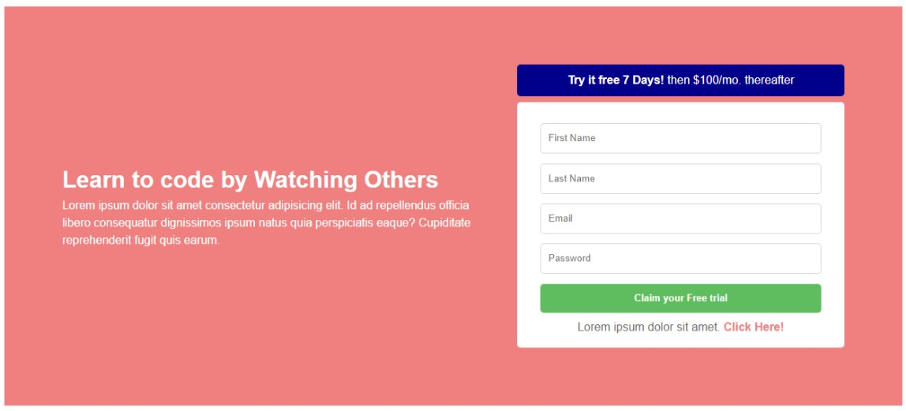

# Sign-Up Form Component

## Overview

This repository contains a simple sign-up form component created using HTML and CSS. The purpose of this project is to showcase the implementation of a sign-up block, demonstrating the combination of HTML for structure and CSS for styling.

This is a challenge or activity from the Front-end Mentor discord

## Preview

## How to Use

1. Clone the repository: `git clone [repository-url]`
2. Open the `index.html` file in your preferred web browser to view the sign-up form.

## Features

- **HTML Structure:**

  - Utilizes HTML to create the structure of the sign-up form.

- **CSS Styling:**
  - Implements CSS to style and enhance the visual appearance of the sign-up block.

## Acknowledgments

A big thanks for exploring this sign-up form component!

## Author

- Adrian Salitico
- https://github.com/frogerall
- Email: saliticoadrian@gmail.com

Feel free to reach out for any questions or feedback!
